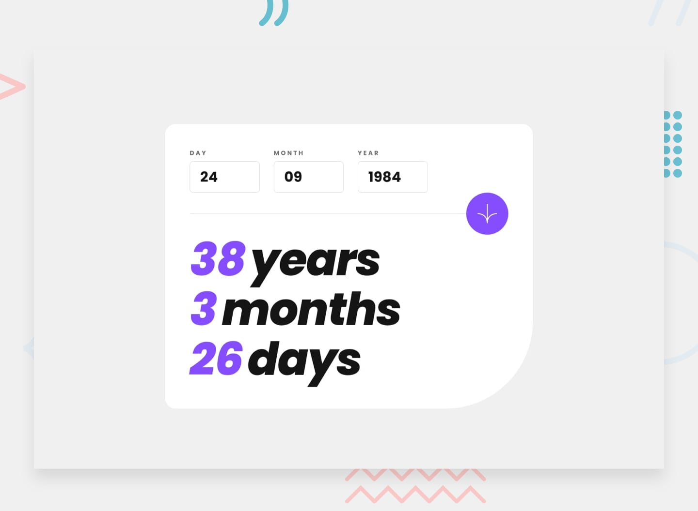

# Frontend Mentor - Age calculator app solution

This is my solution to the [Age calculator app challenge on Frontend Mentor](https://www.frontendmentor.io/challenges/age-calculator-app-dF9DFFpj-Q). Frontend Mentor challenges help you improve your coding skills by building realistic projects using real-world workflows.

## Table of contents

- [Overview](#overview)
  - [The challenge](#the-challenge)
  - [Screenshot](#screenshot)
  - [Links](#links)
- [My process](#my-process)
  - [Built with](#built-with)
- [Author](#author)

## Overview

### The challenge

Users should be able to:

- View an age in years, months, and days after submitting a valid date through the form
- Receive validation errors if:
  - Any field is empty when the form is submitted
  - The day number is not between 1-31
  - The month number is not between 1-12
  - The year is in the future
  - The date is invalid (e.g. 31/04/1991 — April has 30 days)
- View a responsive layout for all devices
- See hover and focus states for interactive elements
- **Bonus**: Watch the age numbers animate smoothly to their calculated values

### Screenshot

### Links

- [Solution on Frontend Mentor](https://www.frontendmentor.io/solutions/age-calculator-app-fWmlOCHW3k)
- [Live site on GitHub Pages](https://mobina-dev-2001.github.io/age-calculator-app/)

## My process

### Built with

- Semantic **HTML5** structure
- **Vanilla CSS** — handcrafted for design precision and maintainability
- **React** (powered by Vite for fast development and builds)
- React **state management** using `useState` and controlled form inputs
- **Custom form validation logic** — handles all edge cases and guides users with helpful feedback
- **Accessibility-first approach**:
  - Proper use of `aria` attributes (`aria-describedby`, `aria-live`, etc.)
  - Screen reader-friendly labels and alerts
  - Keyboard navigability with visible focus styles
- **Responsive, mobile-first design** with flexible layout handling

## Author

- Github - [mobina-dev-2001](https://github.com/mobina-dev-2001)
- Frontend Mentor - [@mobina-dev-2001](https://www.frontendmentor.io/profile/mobina-dev-2001)